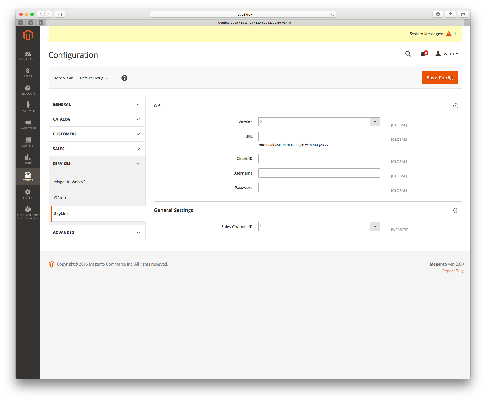
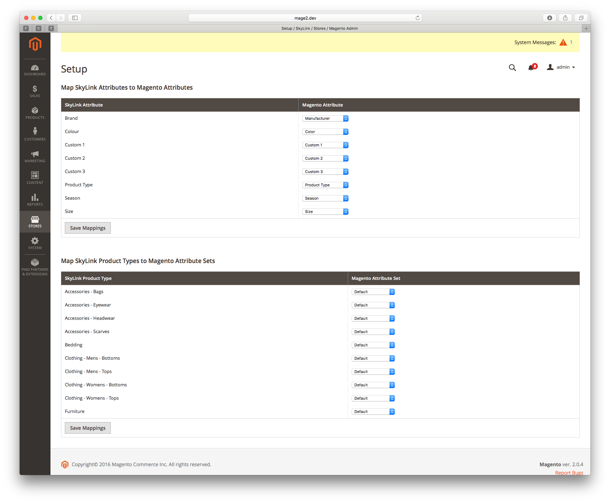
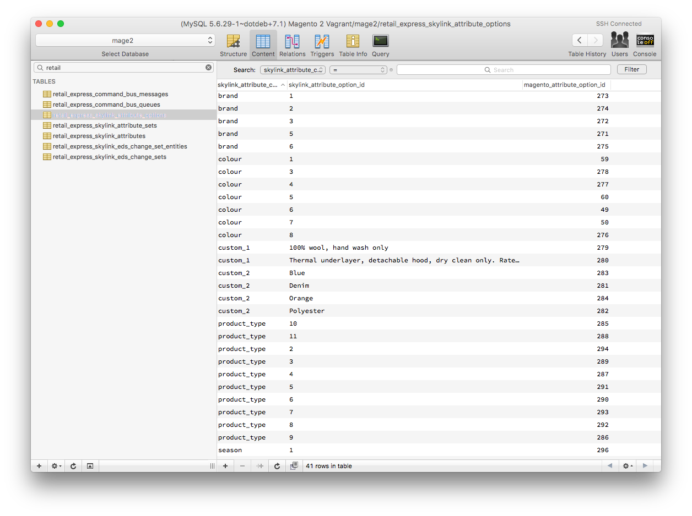

# SkyLink for Magento 2

The following is a technical overview of the usage of SkyLink for Magento 2 and is aimed at developers rather than end-users.

This document is a constant work-in-progress and should be reviewed after each upgrade of the codebase for changes.

Because we are in a pre-release state, things will break. **[Backup Magento](http://devdocs.magento.com/guides/v2.0/install-gde/install/cli/install-cli-backup.html)** early and often.

To get up and running, you should follow the document in it's entirety, from top to bottom. paying particular attention to new concepts, such as **Queued Jobs** and **Initial Sync**.

## Installation

Merge the contents of your Magento 2 `composer.json` file with the following JSON payload:

```json
{
    "repositories": [
        {
            "type": "composer",
            "url": "https://repo.ecom.retailexpress.com.au"
        }
    ],
    "require": {
        "retail-express/skylink-magento-2": "^1.0"
    },
    "minimum-stability": "alpha"
}
```

[Update](https://getcomposer.org/doc/03-cli.md#update) your Composer dependencies. You will notice a number of new packages under vendor. We're interested in:

1. `vendor/retail-express/command-bus-magento-2` - Magento 2 [command bus](https://tactician.thephpleague.com) implementation wtih support for queued command handlers.
2. `vendor/retail-express/skylink-eds` - framework-agnostic package for integrating with Retail Express' Event-Driven Synchronisation functionality.
3. `vendor/retail-express/skylink-magento-2` - Magento 2 extension to manage synchronisation with Retail Express.
4. `vendor/retail-express/skylink-sdk` - framework-agnostic SDK package for connecting a PHP application to Retail Express

Once the code is all in place, you'll want to install SkyLink and update Magento's database with it's prerequisites:

```bash
bin/magento module:enable RetailExpress_CommandBus
bin/magento module:enable RetailExpress_SkyLink
bin/magento setup:upgrade
```

## 1.0 Configuration

You'll need to setup your Retail Express API credentials prior to configuring the extension. At this point, we don't have any pretty error screens telling you to do so, rather, exceptions will be thrown as we cannot talk to the Retail Express API.

### 1.1 Step 1

Visit `Stores > Settings > Configuration > Services > SkyLink` to setup your connection to Retail Express. All fields are required are not validated until the extension tries to talk to Retail Express in `Step 2`:



### 1.2 Step 2

Visit `Stores > SkyLink > Setup`. Here, you have the opportunity to map all available SkyLink Attributes and Product Types to Magento Attributes and Attribute Sets respectively.

You must save mappings for both Attributes and Attribute Sets for product synchronisation to occur.

All Attributes must be mapped and there are defaults created when the extension is installed. At this point it shoudl be possible to map multiple SkyLink attributes to the same Magento Attribute, but this is yet to be tested extensively. When you save attribute mappings, SkyLink will retrieve all of the available options from Magento for each SkyLink Attribute and add them to Magento. All SkyLink Attributes are mapped to "dropdown" Magento Attributes.

> Depending on the number of attribute options and due to the extension's need to sync all attribute options during a mapping, attribute mappings are treated as a queued job and are not available immediately. See **Queued Jobs** for more.

All Product Types must be mapped to a Magento Attribute Set, and these do not need to be unique.

> Product Types are actually driven off the options from the Product Type SkyLink Attribute. This is the most logical way for us to separate products and will, in the near future, be used to determine rules for how Magento Configurable Products are created. For example, Product Type 1 might use Size & Colour to create Magento Configurable Products, whereas Product Type 2 might use Size and Custom 1.



You may rename Magento Attributes, Magento Attribute Options or SkyLink Attribute Options without any adverse affects; the linkage between all of these references internal IDs (see the `retail_express_skylink_attribute*` SQL tables of your Magento installation).

> **Important:** Custom 1, Custom 2 and Custom 3 are not the same as other Retail Express Attributes.
>
> In Retail Express, most attributes are stored in their own table and have a unique ID to reference them. We call them Predefined Attributes.
>
> Custom 1, Custom 2 and Custom 3 are Ad-Hoc attributes. This is because they're associated with products and do not have a unique identifier. If you change the text of an Ad-Hoc Attribute, we generate a new ID based of this text. As a result, we will create a new option to represent the new ID. New synchronised products will get this data added to them, but it means there will be orphaned options in Magento that must be manually removed.



## 2.0 Queued Jobs

The syncing of attributes and their options, as well as products and customers are performed as a queued job, whether multiple entities are updated or only a single one, each is treated as a separate queue job.

These jobs are executed using the `magento` command-line app:

```bash
bin/magento retail-express:command-bus:consume-queue name_of_queue
```

There are four queues and these would be used as such:

1. `attributes` - `bin/magento retail-express:command-bus:consume-queue attributes`
2. `products` - `bin/magento retail-express:command-bus:consume-queue products`
3. `customer grouups` - `bin/magento retail-express:command-bus:consume-queue customer_groups`
3. `customers` - `bin/magento retail-express:command-bus:consume-queue customers`

This starts a continuous script that watches the `retail_express_command_bus_messages` table for any jobs that appear, executes them and then marks them off.

### 3.0 Debugging Queued Jobs

To debug queud jobs, there are two options that can be passed through, `-vvv` to increase verbosity of any output, and `--stop-on-error` to stop the continuous processing of jobs even after one errors out. Their usage is:

```bash
bin/magento retail-express:command-bus:consume-queue name_of_queue -vvv --stop-on-error
```

The full list of arguments and options available can be viewed by typing:

```bash
bin/magento retail-express:command-bus:consume-queue --help
```

> You must run these command-line apps in order to process queued jobs and in turn, sync products or customers. Ideally, [Supervisor](http://supervisord.org) or something similar would be used to mantain an instance of these commands running at all times, however you can utilise options available to you (such as `--max-runtime` to schedule these tasks in your server's cron system.

## Initial sync

In order to trigger the initial sync of your data, a job must be queued for each and every customer and product that will sync from Retail Express to the website. Subsequent syncs will be triggered using EDS.

To create the queued jobs for the initial sync, type:

```bash
bin/magento retail-express:skylink:bulk-products
bin/magento retail-express:skylink:bulk-customer-groups
bin/magento retail-express:skylink:bulk-customers
bin/magento retail-express:skylink:bulk-outlets
```

## Temporary Logging Workaround

Due to the way Magento [sets up it's logging](https://github.com/magento/magento2/issues/2529) and that it [explicitly requires an old version of Monolog (the logging tool)](https://github.com/magento/magento2/blob/2.1/composer.json#L40), an extra step is required to make SkyLink logging (or any third party logging) work properly. This is a [known issue](https://github.com/magento/magento2/issues/2529) that Magento have not resolved.

To do this, merge the following with your `composer.json` file:

```json
{
    "require": {
        "monolog/monolog": "1.18.0 as 1.16.0"
    }
}
